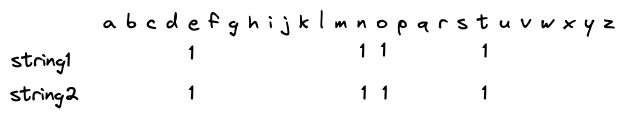

# Coding Interview

"Find out if 2 given strings are anagrams"

## Clarify

Candidate: "Ok great, can I ask a few clarifying questions?"

Interviewer: "Sure, go ahead"

Candidate: "I understand an anagram as being 2 words being made up of exactly the same characters, but in a different order"

Interviewer: "Yes, that's correct. If you can make one of the words by re-arranging the order of characters in the other, they are anagrams."

Candidate: "Can we assume that case does not matter? And if the 2 strings are exactly the same, do we consider those anagrams?"

Interviewer: "Yes, it can be case insensitive, and the same word can be considered an anagram"

Candidate: "Great, thanks. I'm just thinking what else could be relevant to know..."

Interviewer: "No problem, take some time."

Candidate: "Oh - one more edge case: are 2 empty or null strings considered anagrams?"

Interviewer: "For the purposes of this, yes they can be considered anagrams"

Candidate: "Ok, one last one - can I assume that there will be no whitespace or punctuation in either string?"

Interviewer: "Yes, you can assume that"

## Plan

Candidate: "Ok, so I can think of one way off the top of my head to solve this. "

Interviewer: "Cool, let's go ahead and walk through it"

Candidate: "I'm thinking that since the characters are the same in each string, but the order is not, we could sort both strings and then compare them to see if they are equal."

Interviewer: "Cool, sounds like a quick win. What would the time complexity of that approach be?"

Candidate: "Hmm, so for the compare part, it would be O(n) as we need to run through each index of the strings. For the sort part, if we assume a fast sort is implemented, it would be O(nlogn). So in total O(nlogn) time."

Interviewer: "Sounds about right. That is a quick win programmatically, but is there another way to get better time complexity?".

Candidate: "Uh.... So since the most significant part of the time comes from the sorting part, we'd need to find a solution that eliminates that part."

Interviewer: "Sounds reasonable"

Candidate: "So I'm thinking that I can create a kind of 'scoreboard', where I have a list of all possible characters, and keep count of the number of times a particular character occurs in each string. Something like this, where string1 is 'note' and string2 is 'tone'"



Candidate: "Then, I just need to check if the score of each character is the same for each string. The scoreboard can be implemented as an array, with the indices of the array representing each possible character, and the value at each index the difference between that character's count in each string. I'm assuming that only the characters in the set `A-Z and a-z` are used in the words though in this solution. Is that reasonable?"

Interviewer: "Ok, interesting. Yes, let's assume the character set is limited. What is the time complexity now?"

Candidate: "Well, we can loop through both strings once to add to the character score. For string1 we can add 1 to the score, and for string2, we can -1 to the score. That way it's just one loop through the strings, then 1 loop through the scoreboard array to see if the score is 0 for each character. 0 for all the character scores means that the strings are the same. So it O(n) to loop through the strings, and constant time to loop through the scoreboard. The constant time will dominate for strings less than the length off the scoreboard, but for longer strings it will be O(n) dominated."

Interviewer: "Ok, do you want to code it up now, and see how it works?"

Candidate: "Sure!"

## Implement

Candidate: "Ok, I'm going to implement this in node.js flavor JavaScript. I'm going to start with a function declaration and some check and edge case handlers:"


```js
function isAnagram(string1, string2){
  // Guard checks and edge cases

  // if both the strings are empty / null we consider it a match.
  if (!string1 && !string2) return true;
  // One of the strings is null/empty, and the other isn't, it can't be a match
  if (!string1 || !string2) return false;
  // If the lengths of the strings are not equal, it cannot be a match
  if (string1.length !== string2.length) return false;
  // If the strings are literally the same, it's a match
  if (string1 === string2) return true; 

}

```

Interviewer: "Ok, cool."

Candidate: "I'm going to create the array for the scoreboard and initialize all the values to 0."

```js
 let scoreboard = new Array(26).fill(0);

```

Candidate: "Now I'm going to loop through the strings, and add or subtract a score for the corresponding character in the scoreboard. To get the correct index to use, I'll get the character code for the current character in the loop. The codes for alphabetical character start at some non-zero number, I forgot what number exactly, but we'll need to subtract this starting code number so that our character codes translate to a zero based index."

Interview: "Great, let's see what that looks like."

Candidate: "I'm just going to lookup what the JavaScript function is for getting a character code, it's something like `charCode()`."

Interviewer: "`charCodeAt()` I think."

Candidate: "Yeah, thanks. Ok here is the code to loop through the strings and increment or decrement the score for a particular character:"


```js
  const charOffset = 'a'.charCodeAt(0);
  for (let i=0; i < string1.length; i++){
    scoreboard[string1[i].toLowerCase().charCodeAt(0) - charOffset] ++; 
    scoreboard[string2[i].toLowerCase().charCodeAt(1) - charOffset] --;
  }
```

Candidate: "Since I can't remember the character code that `a` starts at, I'm just getting it at run time and storing it in the constant `charOffset`"

Interview: "Good plan"

Candidate: "Ok, now I just need to check that all the values in the scoreboard are 0. I guess there are a few ways to do this. One is to use a for loop to check each value. Another would be to sum all the elements using the array reduce function and check that the sum is 0. Another would be to use the array find method to find any non-zero values."

Interviewer: "Yeah, that's a few options. Which are you going for?"

Candidate: "I'm going with the `for loop` option. It has a slight advantage in that we can return early if a non-zero element is found." 

```js
  for (let i=0; i < scoreboard.length; i++){
    if (scoreboard[i] !==0) return false; 
  }
  return true; 
```

Interview: "Cool, if that's the full code, let's run some test cases"

## Test & Optimize

Candidate: "Great, let me add some test code"

```js
console.log('True cases:')
console.log('-----------')
console.log(isAnagram('note','tone'));
console.log(isAnagram('races', 'cares'));
console.log(isAnagram('ales', 'sale'));
console.log(isAnagram(null,null));
console.log(isAnagram('',''));

console.log('');

console.log('False cases:');
console.log('-----------')
console.log(isAnagram('wrong', 'right'));
console.log(isAnagram('word', ''));
console.log(isAnagram('five', 'one'));
console.log(isAnagram('empty', null));
console.log(isAnagram('programming', 'code'))

```

Interview: "Looks good, what's the output?"

Candidate: "Here it is:"

```
True cases:
-----------
true
true
true
true
true

False cases:
-----------
false
false
false
false
false
```

Interviewer: "Fantastic! Earlier, we made the assumption that the character set was limited. What would the implications be if that were not the case. Let's say all Unicode characters are allowed."

Candidate: "All of Unicode is very large, in the region of 150 000 characters I think. That would make the scoreboard array very large. So it would affect the space complexity by using a high amount of constant space. It would also increase the runtime, as the whole scoreboard array would need to be checked, even though it's unlikely any strings would be anywhere close to the size of the scoreboard array."

Interviewer: "Yeah, it would bog this down substantially. Is there an optimization for this solution, that could mitigate those issues?"

Candidate: "We'd need a way to cut down the size of the scoreboard array, since it will be so sparsely populated with scores. Perhaps if we tried replacing it with a hashmap?"

Interviewer: "Sounds interesting. Can you explain more?"

Candidate: "With a hashmap, we would only need to store scores against characters that actually appear in the strings. The characters found can be the keys, and the score can be the value."

Interviewer: "Great. Will that change the time complexity?"

Candidate: "Hashmaps are O(1) for lookup and insert/update operations, so it should be on par with the array solution"

Interviewer: "Great, can you code the changes in?"

Candidate: "Sure! I'm going to replace the array initialization with an empty object literal, which will serve as as the hashmap. We can also remove the `charOffset` constant, as are keys can now be the characters themselves"

```js
let scoreboard = {};
```

Candidate: "Then, I'll need to replace the inside of the `for` loop to increment or decrement the key value. I'm first going to add a helper function for the cases where the map does not yet have the key, and it needs to be initialized:"

```js
function incValue(map, key, value){
  if (map[key] === undefined){
    map[key] = 0;
  }
  map[key] += value;
}
``` 
Candidate: Now I can call that from inside the `for` loop:

```js
  for (let i=0; i < string1.length; i++){
    incValue(scoreboard, string1[i].toLowerCase(), 1);
    incValue(scoreboard, string2[i].toLowerCase(), -1);
  }
```

Candidate: "Then I can update the scoreboard check code. This will need the for loop to change to checking each key in the scoreboard hashmap": 

```js
  for (let key in scoreboard){
    if (scoreboard.hasOwnProperty(key)){
      if (scoreboard[key] !== 0) return false;
    } 
  }
  return true; 
```

Interviewer: "What's the `hasOwnProperty` line for?"

Candidate: "That's so keys from the default, or base object are not included in the count check"

Interviewer: "Cool - ready to test it again?"

Candidate: "Yeah! Let me run it quick. Ok, here's the output:"

```js
True cases:
-----------
true
true
true
true
true

False cases:
-----------
false
false
false
false
false

```

Interviewer: "Looks good! Cool, I think we can move on from this problem."

Candidate: "Great, thanks!"


