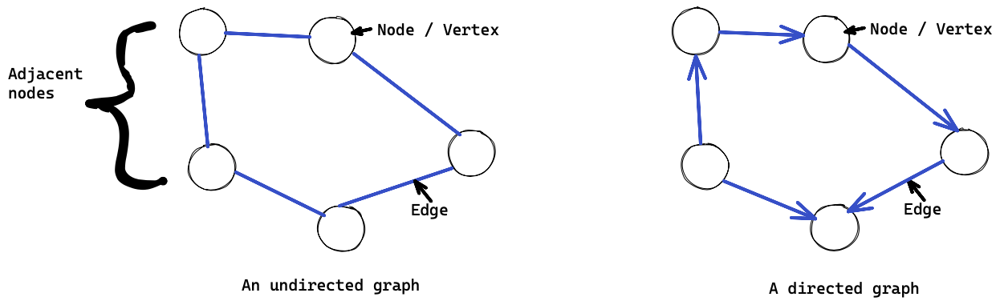
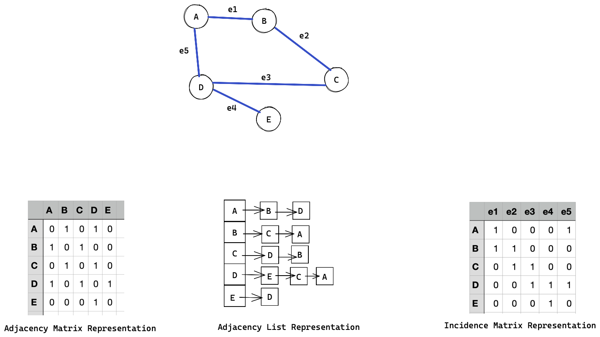

# Graph basics

## What are graphs?

A graph is an abstract data structure represented by vertices connected by edges. Vertices are also known as nodes. Vertices sharing an edge are known as adjacent.

In directed graphs, sometimes called digraphs, the edges between nodes have a direction attribute to show which way a relationship between two nodes goes. Non-directed graph edges have no direction, meaning the relationship goes in both directions. 

A loop is an an edge from a vertex back to the sames vertex. Simple graphs do not have any loops nor do they have multiple edges between vertices. Most graph problems and graph algorithms deal with simple graphs. 

Edges can be weighted or have an edge value, relating to a attribute such as capacity, length, cost, time, etc. Neural networks are examples of graphs with edge values, called weights. 

Traversing a graph, or graph search, involves visiting each vertex in a graph. Because graphs are not hierarchical like trees, a list of visited nodes needs to be kept when traversing a graph to ensure previously visited nodes are not revisited. 

There are two main traversal strategies, namely depth first search DFS, and breadth first search (BFS). 

Depth first search's objective is to explore deeper in a graph at each move. Deeper means further from the starting, or source vertex as possible on each navigation move. This is often done using recursion. The general method is: 
1. Visit vertex `s`
1. Mark the vertex as visited
1. Visit each unvisited vertex with an edge to `s` recursively

Breadth first search's objective is to explore all the vertices adjacent to the starting vertex, before moving on to vertices further from the starting vertex. This is often done by queuing all adjacent vertices, and visiting them. As a vertex is visited, its unvisited adjacent vertices are added to the end of the queue.

1. Visit vertex `s`
1. Mark `s` as visited
1. Add each of the vertices adjacent to `s` to the queue
1. Dequeue the next vertex and repeat

Graph traversal is often used to find a _path_ from one vertex to another. This is useful in many applications such as network route finding, transport routing, and decision planning among many others.

### Dijkstra's algorithm
When finding a path in a graph, we are often interested in finding the shortest path. The shortest path is defined as the path that has the lowest _cost_. The cos of a path is the sum of all the edge weights along the path. 

Dijkstra's algorithm is a common shortest path finding algorithm. It finds the lowest cost path from a starting or source vertex `S` to and end vertex `E`. It does this by starting from the source vertex `S` and calculates and records the cost to each of the adjacent vertices to `S`. `S` is now considered processed. It then chooses the vertex with the lowest cost from the remaining vertices to repeat the algorithm on. If the cost to a particular vertex is less than the cost currently recorded for that vertex, the cost is updated to the lower cost. This repeats until the end vertex `E` is reached, and all the costs from `E`'s adjacent nodes have been calculated. 

Implementing Dijkstra's algorithm is usually done using a priority queue and a set. The priority queue contains all the vertices which have not yet been fully processed. The set holds all the vertices that have been fully explored. When popping from the priority queue to get the next vertex to process, the vertex with the lowest current cost is returned. To prime the algorithm, the costs for all the vertices is set to infinity, except for the starting vertex, which is set to 0. 

Dijkstra's algorithm requires that all weights are non-negative. Dijkstra's algorithm can also be run without a specific end vertex. In this case, the cost of all paths from a source vertex to any other vertex can be calculated and stored. 

### Types of graphs

### How graphs store data

There are many different ways to represent and store graphs. 

An adjacency matrix can be used, where the vertices are listed as the columns and rows indices, and the values are numbers representing if there is an edge (and what weight the edge is) between the vertices. One issue with an adjacency matrix is that it takes a large amount of space, O(N^2) to store the graph. 

The adjacency list is another common implementation, which uses less space than the adjacency matrix. An adjacency list can be thought of as an array of linked lists. Each element in the array is a reference to the head of a linked list, one per vertex in the graph. The linked list contains all vertices adjacent to that starting vertex. 

An incidence matrix is another way to represent a graph. In this matrix, the columns are the edges, and the rows are the vertices. The values of the matrix indicate if there is a connection, or incidence, between the corresponding vertex and edge. Because any particular edge can only have 2 vertices connected to it, the incidence matrix has the property that all column sums equal 2. This can be used to verify an incidence matrix.  

### How graphs compare to other data structures

Graphs can be thought of as the superset of many other structures in computer science, for example trees, heaps, linked-lists, neural networks and so on. 

# Graph cheat sheet

## Cheat sheet explained

The cheat sheet above is a summary of information you might need to know for an interview, but it’s usually not enough to simply memorize it. Instead, aim to understand each result so that you can give the answer in context.

The cheat sheet is broken into time complexity (the processing time for various graph operations) and algorithm complexity (the amount of time and space used for common algorithms).

### Time complexity

The time complexity for various graph operations depends on the type of implementation used for the graph.

An adjacency list performs well on inserting new vertices, and inserting new edges (links between vertices), as inserting into a linked list is constant time, and adding the new vertex to the adjacency list's array is amortized constant time. Removing a vertex is a factor of the number of edges the vertex has, as it also needs to be removed from all the lists of it's connected vertices. Checking if vertices are adjacent requires reading and checking each element of the linked lists for the two vertices. This can take up to O(V) time if the vertices are fully connected to all other vertices. 

Adjacency matrices perform well on querying vertex adjacency, as this is an index lookup on the 2 vertexes in the matrix. This is a constant time operation, which is a large advantage over the adjacency list. Adjacency matrices have a similar performance advantage when removing an edge, for the same reason. Inserting a new vertex into an adjacency matrix can be very expensive, in quadratic time, as a new matrix may need to be created and all elements copied. This can be reduced if the underlying matrix is initially made larger than required, however this requires even more space usage. This can be significant as the space requirement for the unused matrix is quadratic. Removing a vertex suffers the same time inefficiency, as the entire matrix needs to be re-written. 

Incidence matrices are more efficient than adjacency matrices on many dimensions if the number of vertices is much greater than the number of edges. If the number of edges and vertices are similar, then an incidence matrix will be similar to the quadratic times of an adjacency matrix.

### Space complexity
The storage or space needed for a graph also depends on the implementation used, and the ratio of vertices to edges. For fully connected graphs, the space used for both matrix and list representations converge. Adjacency lists are more space efficient for graphs with far fewer edges than vertices. Incidence matrices can also be more efficient than adjacency matrices, but less so than lists, if there are fewer edges than vertices.

### Graph algorithms complexity

Both depth first and breadth first search require visiting each vertex along each edge. This therefore takes O(V + E) time. Depth first search requires a stack to keep track of the vertices to visit, and breadth first a queue. In either case, these structures may need to store at least a subset of all the graphs vertices, requiring O(V) space. 

Dijkstra's algorithm requires a priority queue with all unprocessed vertices and a set containing all processed vertices, therefore it uses O(V) space. The time that Dijkstra's algorithm runs in is similar to a breadth first search, plus a component needed to maintain the priority queue for unprocessed nodes. If the priority queue is implemented using a binary tree as it's base, this can add O(log V) time per search. As we need to search for each edge, it becomes `O(E*log V)`. If a simple array is used instead of the priority queue or similar structure, each search for the next vertex for each edge can result in `O(V*E)`, with `O(V^2)` time if the number of edges and vertices are similar.  

A* search is a more time efficient version of Dijkstra's algorithm, by using heuristics to guide the search path more effectively. This can shorten the search time to the order of the number of edges in the graph. 

Floyd–Warshall is an algorithm to find the shortest distances between all pairs of vertices in a graph (as opposed to finding the shortest path between 1 pair as for Dijkstra). It can achieve this in O(v^3) time, i.e it is not dependent on the number of edge connections in the graph.  

