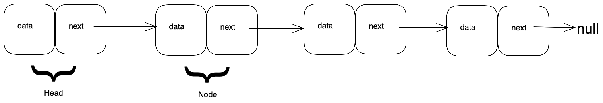
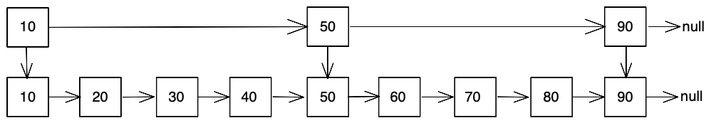

## Linked List Basics

In order to crack the questions above and others like them, you’ll need to have a strong understanding of linked lists and how they work. Let’s get into it.

### What is a linked list?

A linked list is a data structure used to store a collection of data elements. In that aim it is similar to an array. However, unlike an array, the data elements do not need to be stored contigously in memory. Rather, each _node_ in a linked list has a pointer or reference to memory location of the next node in the list. This means that that linked lists do not have a fixed size like an array, and can easily grow and shrink as elements are added or removed. 

Another advantage a linked list has over arrays is that inserting or removing elements from a linked list is possible in constant time, whereas removing or inserting into an array generally takes linear time. 

Since the data elements are not stored sequentially in contingous memory, linked lists are not as efficient as arrays at random access of elements. Indexes are commonly used to access any element in an array in constant time. With linked lists, to access an element generally means walking the list from one node to the next. This takes linear time. 

### Types of linked lists

There are a number of variations on the standard singly linked list. 

A doubly linked list has nodes with links to next _and_ previous nodes, making it possible to traverse the list in either direction. 

A circular linked list's last node has a link to the list's first node. This is useful for implementing certain types of circular buffers. It is also useful for implementating round robin type schemes. 

A multi-linked list has multiple links from each node. The different links point to the 'next' node based on some ordering or logical criteria. Using this, it is possible to essentially have the list ordered on multiple properties. For example, in a movie list, there could be a link to the next movie alphabetically, another link to the next movie chronologically, and another link to the next movie by the same director. Multi-linked lists are also useful for implementing sparse matrices, where a node has a link to the next number in the row, and a next number in the column. 

Java has a built-in linked list implementation called `LinkedList`. Python has a `deque` class in its collections module which is implemented as a linked list. In the Standard Template Library (STL) in C++, there is a linked `list` class which implements a doubly linked list. 

### How linked lists store data

Linked lists are made up of a string of nodes. Each node is a container which stores the data element along with a reference to the next node. The first node is known as the _head_ of the list. This is often used as the entry point, or handle to the linked list. The last node is the list generally has it's _next_ pointer set to null, except in circular linked lists, where the last node points to the head node. 

### How linked lists compare to other data structures

Linked lists are mainly contrasted to arrays. Arrays have faster access time, in constant time, to access a random element through indexes. Accessing an element in a linked list takes linear time. Linked lists are faster at inserting and removing elements, which can be done in constant time if the target position of the node is known, whereas arrays take linear time. Linked list can also grow to very large sizes easier than arrays, as linked lists are not bound to available contiguous memory blocks as arrays are. 

Queues and stacks are often implemented using linked lists, as the size of these structures are often large and dynamic. Queues and stacks also do not require random indexed access to elements, as elements are added and removed from the ends of them. Linked lists perfom well here, as adding or removing elements from the ends of the list can be done in constant time. 

## Cheat sheet explained

The cheat sheet above is a summary of information you might need to know for an interview, but it’s usually not enough to simply memorize it. Instead, aim to understand each result so that you can give the answer in context.

The cheat sheet is broken into time complexity (the processing time for various linked list operations) and algorithm complexity (the amount of time and space used for common algorithms). 

### Time Complexity

The important point to remember when considering time complexity with linked lists is that accessing or finding a random element in a linked list takes linear, O(n), time, whereas adding or removing a known element take constant time. This is almost directly opposite to an array. Understanding this will help you with questions of where to use a linked list vs an array.

To improve the performance of a linked list for accessing and searching elements, sorted linked lists can be augmented with ancillary structures. One such structure is known as a Skip List. This creates multiple layers or hierarchy of linked lists, each with some fraction of the number of the nodes of the original list. This makes it possible to find significant elements places in a list faster by trading off space for time. Skip lists can be thought of as pre-computing binary search nodes in a list, or as a sparse index. Using skip lists mitigates some of the performance deficiencies of linked lists compared to arrays, bringing down search time to O(log n) time, at the expense of using more space. 

### Algorithm Complexity

Sorting and searching linked lists is maybe not as common as for arrays, but it can still be done. 

Sorting a linked list has the advantage of being able to easily change the position of a element in the list, simply by re-assigned the links to it's containing node. In an array, changing the position of an element generally means copying and moving multiple other elements, which normally means using extra temporary space. However, to access a random element in a linked list takes far longer than in an array. Merge sort is normally preferred over quicksort with a linked list, as a quick sort has a heavier reliance on random access to elements, which is slower in linked lists than arrays.

Search algorithms operating naively on linked lists generally takes longer than searching in an array, due to the lack of inherent random access required by algorithms such as binary search. However, these algorithms can be sped up to similar time orders of complexity by using techniques such as skip lists, and using fast and slow pointers. 

