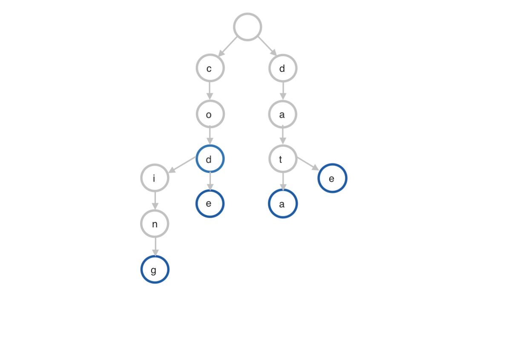

## String basics

In order to crack the questions above and others like them, you’ll need to have a strong understanding of strings and how they work. Let’s get into it.

### What is a string?
A string is an ordered sequence, or string, of characters. Is is usually considered a data type, and often included as part of language primitives. In most languages, strings are implemented using an array of bytes. The bytes are encoded using some character encoding. Earlier systems used ASCII encoding, with Unicode encoding used in later systems. 

### Types of strings (Java, Python, C++)

C++ provides a mutable string, meaning the string contents can be changed after creation. Python and Java provide an immutable string type. 

Immutable strings require a new string to be created if any changes are made. This has performance implications for string concatenation when joining a number of strings, running in quadratic time. Java provides a mutable StringBuilder class, which should be used for concatenating multiple strings. In Python, generally the `.join` method on strings should be used, which accepts an iterable, i.e. multiple strings. Using Java's StringBuilder or Pythons `.join` provides a linear time solution for multiple string concatenations. 

Another class of strings are C style strings, so named as they are used in the C language. These strings are simple arrays. A special terminating character is stored directly after the last character of the string. This terminating character marks the end of the string within the array, or buffer. C++ does have support for C style strings, but is it preferable to use C++ style strings in pure C++ code. Java, Python and C++ strings are more complex data structures, with class or struct methods for manipulating and querying them.

### How strings store data
There are very generally two types of string implementations: null-terminated strings (C strings), and non-null-terminated strings. The principle difference between these types of strings is how the termination and tracking the length of the string is handled. 

Null-terminated strings (C strings) are character arrays terminated with a null (NUL) character, typically a byte with all bits set to 0. The length of the string is calculated by counting the characters in the string up to the terminating character. Care must be taken in working with C style strings, as writing and reading past the end of the string terminator can result in buffer overflow errors, causing unexpected behaviour and security issues by overwriting or reading unrelated memory contents.

Non null-terminated strings, as used in C++, Java and Python implementations, have the underlying array and the length stored separately. In [Java]((http://docjar.com/html/api/java/lang/String.java.html)) this is a class with private fields for the character array and length, which are not directly accessible from outside the class. 

C++, Java and Python strings have useful class and instance methods to work with strings. Commonly used are 
- Substring queries, to return a new string from a subset of the original string
- Replace methods to return a new string with a specific sequence of character substituted for another
- String formatters to create strings from a template and data variables. 
- Trimming methods to create new strings without leading or trailing whitespace.
- Upper and lower case conversion methods
- Methods to check if a string contains a given substring. 

For more advanced pattern matching in strings, Regular Expressions, or regexes are commonly used. Most modern string implementations have support for regex queries.

### How strings compare to other data structures

A Trie, or prefix tree, is a type of search tree, often used with strings. The strangely spelt name is from "reTrieval", but mostly pronounced like "try". Tries are useful for answering questions like "Given an input sequence 'cod', what possible words could be formed?". Therefore tries can be used for autocompleting words in text input, from search to text. 

A trie data structure is made of nodes indexed with a single character key. Each node has references to its child nodes. The number of child nodes is bounded by the number of unique characters in the alphabet space making up the stored words - often this is described as 26 for the English language, but it can be larger taking into consideration accented characters, or if there are numeric and special characters in the alphabet space. Each node also has a flag signalling if it is the end of a word, represented by a blue node below: 

Since each node only contains one character, the complete key to that node is distributed from its parents down to that node. Retrieval of a key is a depth-first search of the trie. A search for a key ends when a end of word node is reached. Inserting a new key is done by following the trie through each character of the new key, and adding each character as a trie node where needed, and marking the node of the last character as the end of the word. 

Inserting and search is done is O(keySize) time. Space requirements are much larger than a simple string though, at O(AlphabetSpace*keySize*n), n being the total number of keys in the trie. 

# Cheat-sheet explained

The cheat sheet above is a summary of information you might need to know for an interview, but it’s usually not enough to simply memorize it. Instead, aim to understand each result so that you can give the answer in context.

The cheat sheet is broken into time complexity (the processing time for the various string operations) and space complexity (the amount of memory required). While you might be asked about these directly in relation to string data structures, it’s more likely that you will need to know these in relation to specific string-related algorithms, such as substring searching, which is what the second section details.

## Basic Operations Time Complexity

Accessing a character at a particular index in a string is an O(1) operation, as strings are stored as arrays. Deleting characters from immutable strings means creating a new string and copying the remaining characters over, so this is a O(n) operation. For mutable strings, it means removing characters and shifting remaining characters, which is also O(n). Inserting into a string is a similar level of work as deleting, again O(n) time for both mutable and immutable strings.

Searching for a substring using built in methods in most languages is generally `O(n*m)`, depending on the algorithm used. We explain this more in the algorithm section. 

Slicing, or splitting a string refers to creating multiple substrings by spliting a string on a character or character sequence. This is often used in parsing CSV type files. It runs in O(n) time, as each character needs to be copied out into the new strings. 

Joining, or concatenating strings is a more complex operation. For immutable strings concating multiple strings can result O(n^2) time complexity for large numbers strings. For concating two strings, it is closer to O(n), where n is the total number of characters in both strings. Mutable strings can concatenate faster, depending on the underlying implementation. For implementations where the array is doubled in size each time a resizing is needed, string concatentation is closer to regular array time complexity. 

Comparing strings is also O(n) time, as generally each character needs to be checked. 

For tries, there are 2 signficant operations: Inserting a new key, and retrieving (searching) for a key. Both run in O(m) time, where m is the size of the key. This makes tries very scalable, as the time complexity is not dependent on the size of the trie itself. 

## String Algorithm Complexity

Radix sort is usually shown in the context of sorting numbers, but it can be used to sort strings, if the buckets are indexed by characters rather than numbers. Essentially the alphabet space of the strings becomes the base as used by the radix sort algorithm.

Many string algorithms center around searching for a all occurences of a substring within a string. This is a fundemental operation in text centered applications, from HTTP processing to word processing. The naive implemenation slides the search pattern by 1 character over the length of the string to check for the pattern starting at each index. This makes it an `O(m*(n-m+1))` operation as the pattern needs to be checked at each character in the string. The more sophisticated algorithms in the list attempt to reduce this complexity. These algorithms reduce the time by using strategies such a precomputing tables, creating rolling hashes, using state from previous matching. They also use the fact that useful information for short cutting the naive search approach is availalbe in the search pattern itself - for example if the search pattern has repeating or no repeating characters, this can help in skipping some sliding indexes compared to the naive search. In all, these algorithms provide ways to reduce searching to O(n) time complexity. 

