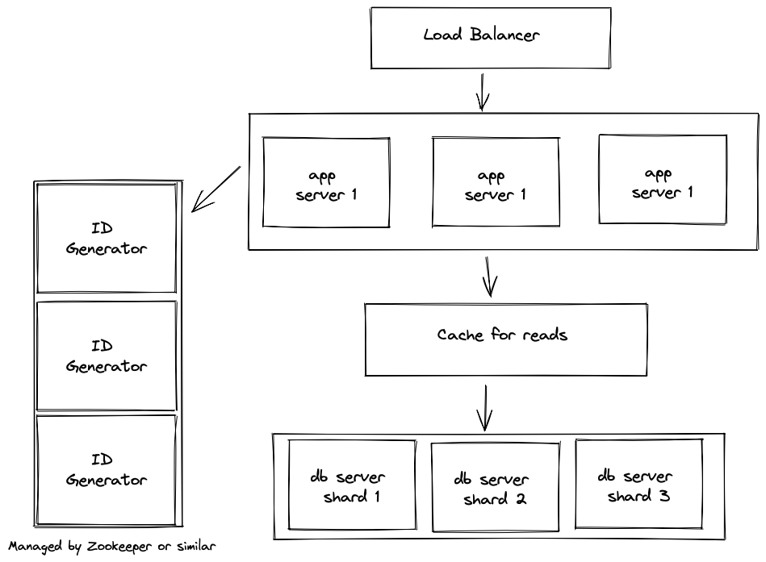

# Designing a Tiny URL system

## Question

"Design a database for a tiny URL implementation"

Candidate: Ok, as I understand a TinyURL system, a user will input a URL. The system will return a short 'pointer' URL to the full URL. It would be something like `https://tiny.url/shortCode`. When someone visits the short URL, they will be redirected to the full URL. `shortCode` would be generated by the service as a unique reference to the URL. As I understand the task, I need to design the persistent storage component of a TinyURL system.

Interviewer: Yes, that's correct

Candidate: Great, to clarify, we'll need to design the data schema, database architecture, and choose a database technology to use. 

Interviewer: Yes, that's correct. 

Candidate: Do we need to specify a particular brand or instance of database engine, or can we specify the technology type, e.g. relational, key-value, document etc?

Interviewer: Let's keep it at the level of technology type, we don't need to specify the vendor or engine. 

Candidate: Great, thank you. Now I'm assuming this system would need high availability and high scalability?

Interviewer: Yes. 

### High Level Design

**Calculate Metrics**

Candidate: Great, how many users are we catering for? Or in other words, how many URL's would we be generating each second, and how many URL's would we be serving each seconds. I'm assuming that it would be highly asymmetric, in that there would be many more URLs served each second than URLs generated?

Interviewer: Yes, it would be  asymmetric. We would need to cater for a high volume of traffic, as it would be used as the default URL shortener for a popular social network, which has about 300 million daily active users. 

Candidate: I see. Ok, let me try some rough calculations. Let's say 20%, or 60 million, users are frequent original posters (assuming that most social users consume or share existing posts). If they post something with a URL say once per day, then we would need to create 60 million URLs per day. `60 million / (24hour*3600seconds in an hour) = 695` URLs created each second if equally spaced across the day. 

Interview: That's probably high for current users and usage as not everything posted is a link, but the user base is growing, so it will be a good estimate for the next few years.

Candidate: Cool, we'll go with those numbers then. For URLs served, I'm assuming there would be a spread of popularity. Some shortened URLs could have zero clicks, while a few may go viral and get tens or hundreds of thousands or even millions of clicks. 

Interviewer: Sounds like a decent assumption. 

Candidate: Alright, let's assume that on average a URL would be read maybe 100 times, heavily weighted to the most popular URL. So we can roughly say there are 100 times more reads per second than writes. 

Interviewer: It's definitely higher than the writes, but that sounds a bit low as the ratio. 

Candidate: Let's up it by an order of magnitude, say 1000 times? 

Interviewer: Ok sounds good. 
 
Candidate: We will be generating a lot of URLs! Would we need to keep them forever, or should they expire after some time?

Interviewer: Hmm, I think we can expire them after some time.

Candidate: Ok, we'll keep track of when a URL was created, so we can remove it.

**Identify high level components or services**

Candidate: Ok, now that we know the scale that we are designing for, it's easy to see that a single server will not meet the load or availability requirements. And, because the link records are independent (i.e not related to each other), it means that we are not bound to relational databases necessarily, and can look for the primary characteristic as being easy to scale horizontally. 

Interview: Seems good. 

Candidate: As we talked about above, a few of the links will get the most traffic. This seems like a good candidate for a caching layer, so we can reduce the load on our databases as well as make the most used links quicker. 

Interview: That's a good idea.  

**Identify bottlenecks**

Candidate: However, we have a bit of a problem with introducing a distributed system now. 

Interviewer: What's that?

Candidate: Well, we need to generate a unique `shortCode` for each of the URL's right?

Interviewer: That's right. 

Candidate: On a single database server architecture, this is simple, as we'd just let the database generate an ID for us. Then we could represent this numeric ID the database creates with a number system that uses a larger base, which would be the URL `shortCode` the end user sees. 

Interviewer: Why would we convert to a representation with a larger base? Why not just use the numeric ID that the database creates as the `shortCode`?

Candidate: As I see it, if we are generating `shortCode`s at the rate we calculated above, this would soon become a very long number in base 10, or decimal. Our tinyURL would soon become a very long URL the more the service is used. If we re-encoded that ID as a number in a system that uses letters, numbers and is also case sensitive, which could be a Base 62 representation, then we would be able to constrain the length of the `shortCode` to be, well, short. 

Interviewer: Ah, so after a year of generating shortCodes, we'd be at ID `60million *365 = 21 900 000 000`, which is 11 characters long. But if we represented it in a higher base, like base 62, it would be something like `nU6aqs`, only 6 character, making it a lot more tiny. 

Candidate: Yeah, exactly that. But now back to the initial problem, we will be running multiple servers, or partitions, and if each server is creating an ID, we will be bound to get collisions. 

Interviewer: That's true.

Candidate: So, we'll need some other scheme to come up with an ID for the `shortCode`. We could make a central shared ID generator, that each server can call when creating a new shortCode. 

Interviewer: Would that have any side effects, or other implications?

Candidate: I guess the main thing is that now the whole system relies on the central ID generator being up all the time. If it fails, then we won't be able to create new shortCodes, although reading would still work. 

Interviewer: Is there a way to make that more reliable?

Candidate: I think there are a few ways to go. We could make a few more ID generators, and the API servers could 'round robin' between them to get a new number. Each of the servers would be able to serve from a range of numbers, so that they don't return the same numbers. So ID generator 1 would serve from say 0-50 billion, generator 2 from (50 billion +1) to 100 billion etc. Then if one ID generator goes down, the servers can still create shortCodes, but just from a different range. 

Interviewer: That sounds promising. What are the other ways?

Candidate: Well, another way is to refine the above design. If we extend the concept of pre-defined ranges, instead of returning a single ID, we could return a list of numbers to the application servers. That way things are sped up, as the application servers do not need to call the ID generators each call, making it even more reliable. They can assign a shortCode from the list of numbers, and only when they run out do they need to call one of the ID generator servers again. 

Interviewer: So extra reliability and speed at the same time?

Candidate: Yeah! I've not used, but I've seen systems like Zookeeper that I understand can manage this distributed key generating scheme. Then we can use existing reliable software for this part, instead of writing it from scratch, especially since it is a core function of the system. 

**Draw an architecture diagram**

Interviewer: Sounds good, though we've got quite a few parts here now. 

Candidate: Yes, I think I'll draw a rough architecture diagram so we can bring it all together and check it. 

Interview: That looks a bit more understandable now! I see you've added in a load-balancer?

Candidate: Yes, it's not part of the data design, but I thought I'd add it in for completeness. One thing we haven't settled on yet is a database technology. I'm thinking that since the schema is quite simple, and various NoSQL solutions have good support for sharding, we should use that. I'm just considering between a key-value store, or a document DB. 

Interviewer: Sounds logical. What would drive the consideration between the 2 technologies?

Candidate: I think it may depend on how much extra info we are storing with each record, and if we want to access it. A document store might be better if we for example we are storing a user or some other information against the URL. We also know we will be storing a timestamp, so we can purge expired links. We might also want to store an access counter, so we know how many times a link has been accessed. 

Interviewer: I think it's reasonable to assume that there would be meta-data stored with the link. 

Candidate: Ok, in that case, I think we should go with a document store, as it will provide that flexibility. 

Interviewer: Makes sense. 

Candidate: I think we just need to check that the design satisfies our initial objectives now. 

Interviewer: OK

Candidate: The main requirement was that it generated a unique short URL given an arbitrary one. It also needs to scale to handle a large amount of traffic, perhaps up to approx 600 writes per second, and 100 -1000 time more reads. It should also be highly available. I think it meets those requirements, as it generates a short URL using a Base62 representation of the record ID. It handles scale by making use of database sharding, a distributed key generation system, and a cache for the most popular links. It also handle availability by having multiple servers, or redundancy, for each key component.

Interviewer: Good - it sounds like the only unknown part for you in the system is the lower level details of Zookeeper?

Candidate: That's right, I haven't used it or configured it, but I would try use it or something similar before writing a custom solution there. It sounds like a common problem that it solves, so I would think there are existing systems we could leverage. 

Interview: Ok, thanks, I think we're about out of time for this section, so we can move on. 

Candidate: Great, thanks.  

