# Tree Basics

## What are trees?

A tree is an abstract hierarchical data structure. It is represented by a group of linked nodes, with a single root node. Each node can have zero or multiple children. A leaf is a node with no children. 

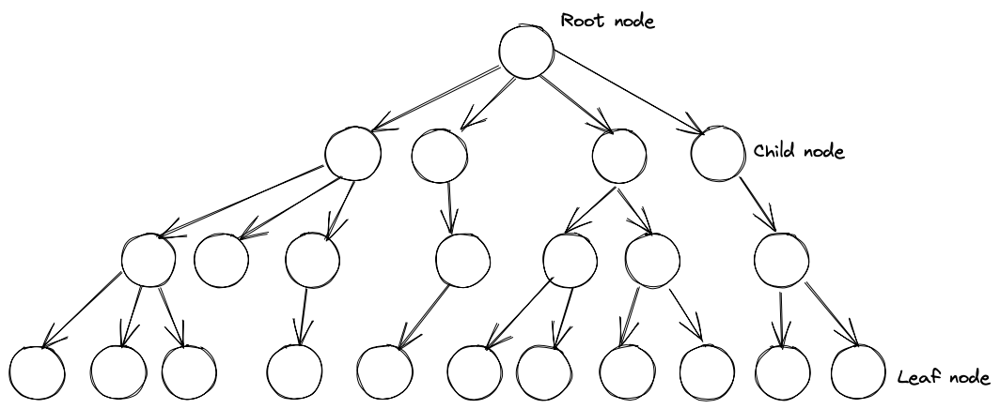

When talking about trees, we often mean binary trees. Binary trees are a type of tree where each node has at maximum 2 child nodes - a left child and a right child. 

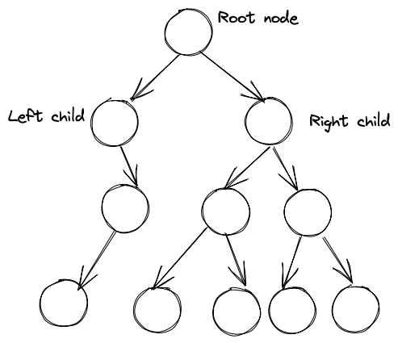

### Binary Search Trees
A particular type of binary tree is a binary search tree, or BST. In a BST, the nodes are ordered by their keys. The key of any node is >= the value of its left child key, and <= the value of its right child key.

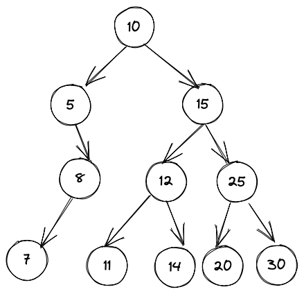

When elements are stored in a binary search tree, search, insert and delete times can be logarithmic, as up to half the tree's elements can be eliminated at each node when searching the tree. This means BSTs offer the advantages of a linked list (large size, quick removal and adding of elements), along with the search time advantages of a sorted array.

Searching, inserting, and deleting from the tree are very similar processes. Searching is a recursive process, by checking if the desired key is equal to the current node's key. If it is, the node is returned. If the desired key is less or greater than the current node's key, then the operation is run on the current node's left or right child respectively. Inserting an element into a BST involves searching the tree to find an empty leaf where the new element's node can be added. Deleting involves searching for an element, and then removing it from the graph by updating the links to and from the node. 

Tree traversal is another common operation. The aim is to visit every node in the tree, for example to list the tree's contents or for serialization. There are two main traversal strategies: depth first, and breadth first. Depth first traversal visits nodes in order from root down to leaf recursively. Breadth first visits nodes in order of the same level. 

Depth first traversal has 3 sub-types: In-order, pre-order and post-order traversal. These refer to the order in which a node and it's child nodes are visited. 

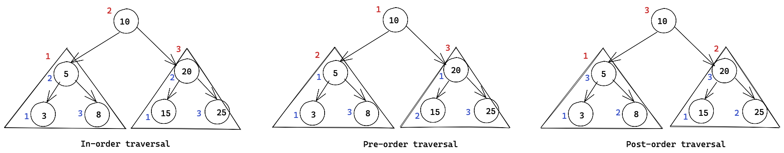

In-order traversal visits the node's left sub-tree, then the parent node, then the right sub-tree. This happens recursively. In this method, a BST's keys will be visited in ascending order.

Pre-order traversal visits the node first, then the left sub-tree, then the right sub-tree. This happens recursively. 

Post-order traversal visits the left sub-tree, then the right sub-tree, and finally the node. This happens recursively. 

Binary trees can take on various shapes depending on how the nodes are distributed. At the one extreme, a tree with only 1 child per node is called a **degenerate tree**, as it has degenerated into a linked list. A **height balanced tree** is one where the left and right sub-trees of every node have at maximum a height difference of 1. The height of a node is the length of the longest path from the node to a leaf. 

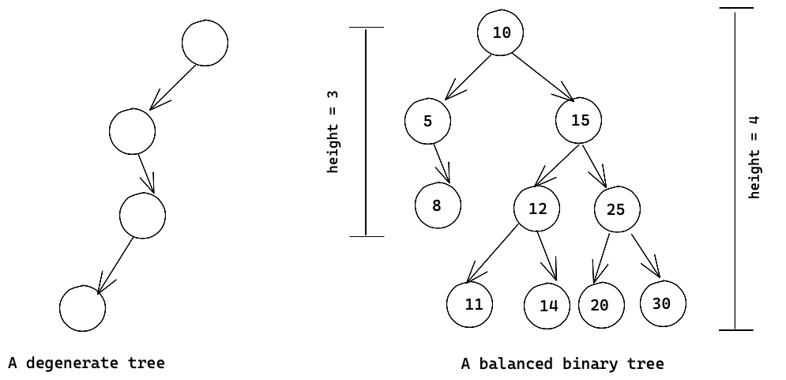

BSTs can become unbalanced as elements are added or removed. In order to keep the search and insert times logarithmic, binary search trees should be kept balanced, as the worse a tree is unbalanced (to the point of a degenerate tree, or linked list), the closer the search and update times tend to be linear. 

A key operation used to balance trees is known as a rotation. This is a way to re-organize nodes in order to balance a tree. There are two types of rotations - a left rotation and a right rotation. 

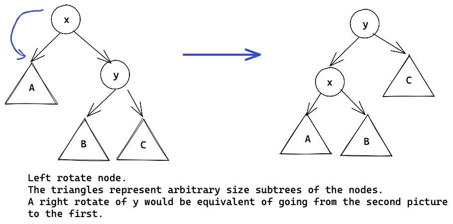

Self-balancing trees are BSTs that automatically keep their maximum height difference as close to 1 as possible. Two well known self-balancing BST's are red-black trees and AVL trees. 

### Red-black trees
A red-black tree is a binary search tree where each node has an additional property to mark it as a red or black node. Red-black trees are considered valid if the following properties apply to it:
- Every node is red or black
- The root node is black
- Every possible path through the tree from root to leaf has the same number of black nodes
- There are no two consecutive red nodes in a path (there can be any number of consecutive black nodes in a path).

When operating on the tree, the following rules also apply: 
- Any new node added is red
- Any null (empty) node is considered black

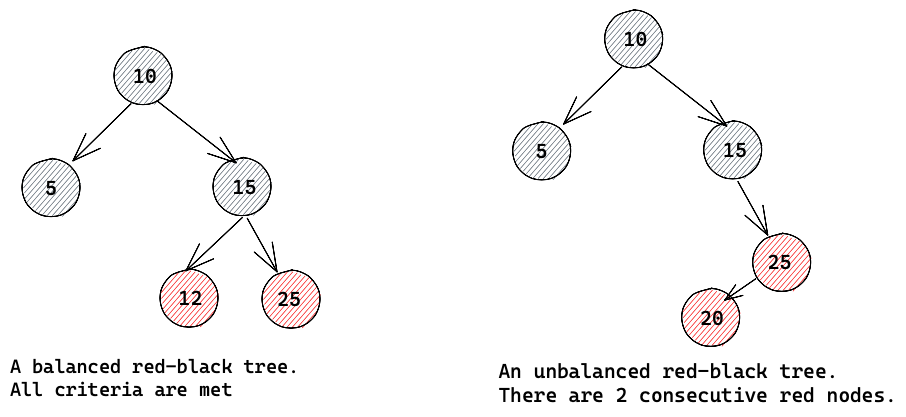

If after an insert or delete a tree does not meet the criteria as above, either a color flip or a rotation operation must be performed to re-balance the tree. The rules to determine which operation needs to occur are:
- If the node with an issue has a red aunt/uncle node, do a color flip on the node's grandparent and immediate children. 
- If the node with an issue has a black aunt/uncle node, rotate around that node's grandparent. After the rotation, fix the affected node colors to comply with red-black tree properties

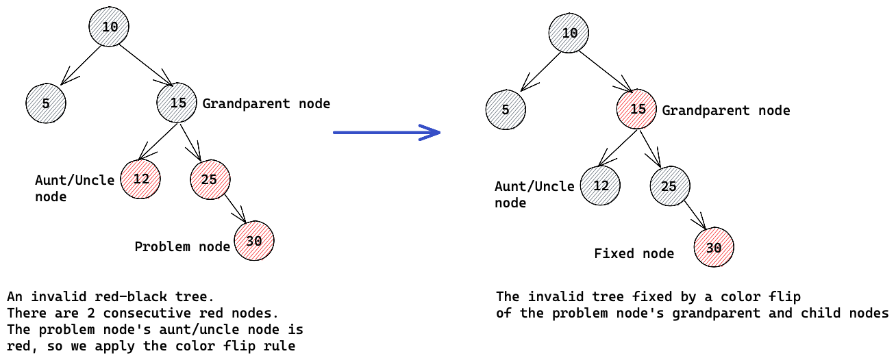

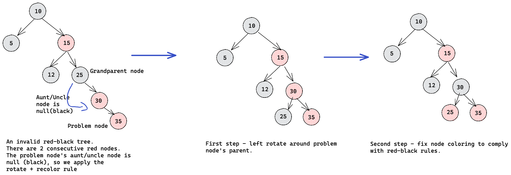

### AVL trees
AVL (Adelson-Velski/Landis) trees were the first self-balancing binary search trees. AVL trees work by recording the height difference between the left and right sub-trees of every node, calculate as `left_height - right_height`. This height difference is known as the _balance factor_. For an AVL tree to be valid, the balance factor at each node must be -1,0 or 1. 

After modifying an AVL tree by inserting or deleting a node, the balance factors at each node upstream from the modification must be updated. If an imbalance is found at a node, i.e. the balance factor is not -1,0 or 1, rotations must be performed to re-balance that node.

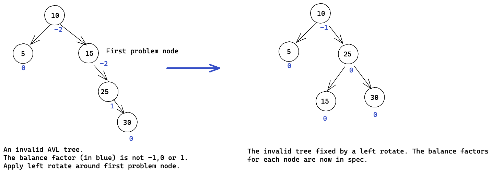

### Other types of trees

Splay trees are adaptive roughly balanced binary trees, i.e not completely balanced. Splay trees optimize on keeping the most frequently accessed node near the top of the tree for faster access to those nodes. After a node is searched or added to a splay tree, the tree is _splayed_ so that the node becomes the root of the whole tree. The splaying operation is performed by one or multiple rotations until the most recently accessed node becomes the root. Because more frequently and recently accessed nodes will be moved nearer to the root of the tree, and therefore be more quickly accessible again, splay trees are suited for cache implementations. It is possible for splay trees to become completely unbalanced, depending on the pattern of node access.

A Cartesian tree is a binary tree built from an ordered list of keys. When the tree is traversed in-order, it will produce the ordered list it was produced from. The tree must have an additional property that the parent of any node is smaller than the node itself. 

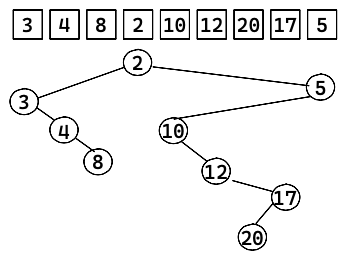

B-Trees are search trees designed for large amounts of data, typically on disk / storage. They are optimized to reduce the number of disk access operations needed to retrieve a node, as disk access is very slow relative to RAM or processor speed. B-Trees are not binary trees, as they may have more than 2 children per node. They are characteristically "fat", or wide. 

### Types of trees (Java, Python, C++)

Most languages do not have directly usable tree implementations, like arrays or linked lists. Generally trees are implemented based on the particular use case. Some classes, such as the Set class in the C++ STL uses a red-black tree implementation. 

### How trees store data

The primary structure in a tree is the node. The node contains the data element being stored, as well as references to the node's child nodes. 

### How trees compare to other data structures

Trees are used to store and retrieve data elements, so in that sense they can be compared to arrays and linked lists. Unlike arrays, we've seen how trees can store larger amounts of data as it is not reliant on contiguous memory, much like linked lists. Unlike linked lists though, trees are capable of faster search times (O(log n) compared to a linked lists O(n)) if the nodes of the tree are ordered, with the BST as an example. 

Trees are also a subset of graphs.

# Trees Cheat Sheet

## Cheat sheet explained

The cheat sheet above is a summary of information you might need to know for an interview, but it’s usually not enough to simply memorize it. Instead, aim to understand each result so that you can give the answer in context.

The cheat sheet is broken into time complexity (the processing time for various tree operations) and algorithm complexity (the amount of time and space used for common algorithms). 

### Time complexity

For inserting, deleting and searching in binary search trees, Cartesian trees and KD trees, the best time to expect is O(log n). However, if the trees are not balanced, and degenerate to a linked list type structure, the operations will take O(n) time. 

For self-balancing trees such as B-trees, red-black trees, splay trees and AVL trees, operations are O(log n). This is because a balanced binary search tree allows for discarding half the nodes at each point in a search of the tree. 

Traversal of all types of trees takes O(n) time, as by definition every node needs to be visited at least once.

### Space complexity

The space complexity of a depth-first traversal is O(n) as the recursive nature of the algorithm means that at worst all the nodes would need to be stored on the stack in the case of a degenerate tree. 

For a breadth-first traversal, the best case would be O(1) in the case of a degenerate tree. For more balanced trees, space complexity tends toward O(n), as lower layers of a tree can hold up to n/2 of the total nodes in the tree.  

### Tree algorithm complexity

For all traversal methods, O(n) time is taken, as every node needs to be visited.

Tree sort is an algorithm used to produce a sorted list from an unsorted source list or array. It does this by inserting each of the elements from the source list into a new BST. After all the elements have been inserted into the tree, the tree is traversed in-order, which then produces a sorted list of all the elements. Inserting a single element into a balanced BST is best case O(log n) time. Therefore inserting all the elements would take O(n log n) time. The worst case would be if the binary tree being constructed is degenerate. The total inserts would then take O(1 + 2 + 3 + ... n) operations, which tends to O(n^2) time. The space complexity is O(n), which is needed to store the constructed tree.  

Splay sort is a variant of tree sort. A splay tree is used instead of a plain BST. As a splay tree keeps the last accessed node at the root, it performs very well on nearly sorted source data, as single inserts can be close to O(1). Therefore, the best time insert for all elements into a splay tree can be `O(n*1)`, or O(n). Since splay trees are adaptive (changing their root for each insert operation), a splay tree can't become degenerate. This makes the worst case insert O(n log n). 

Cartesian sort uses a combination of a Cartesian tree and binary heap to sort elements. First, a Cartesian tree is constructed from the unsorted list. A binary heap is then created with the root of the tree as its only element. As this is the smallest element, it is then popped from the heap, and put as the first element of the sorted output list. Then each of the root node's children are added to the binary heap. The tree is therefore traversed pre-order (as any node in a Cartesian tree is smaller than its children). After both the children have been added, the smallest child is popped off into the next position in the sorted output list. The algorithm then moves to the next node in the tree, until all nodes have been traversed. By using this combination, it can achieve a best case of O(n) sort time, and a worst case of O(n log n).

